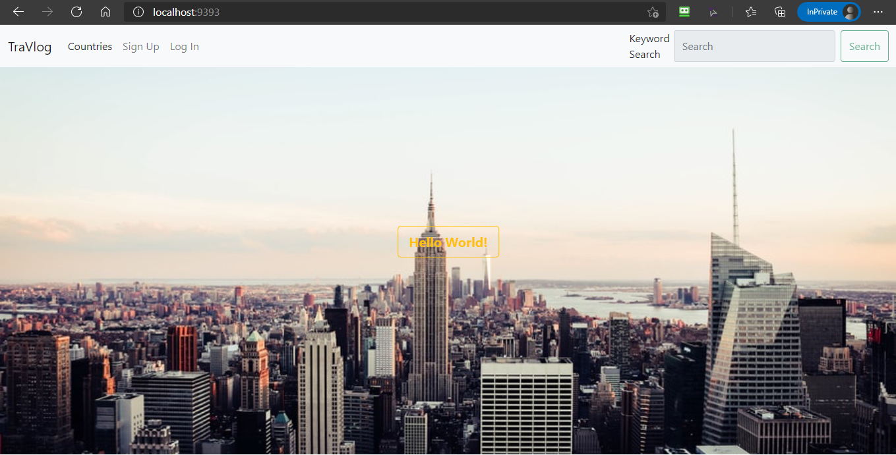
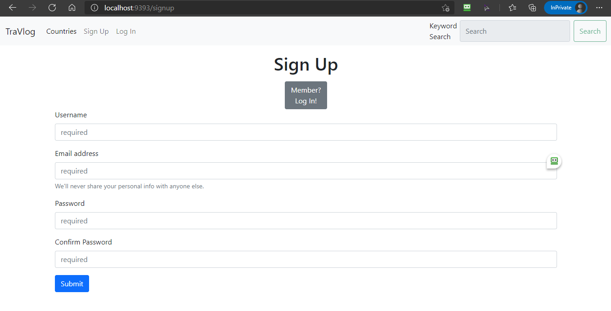
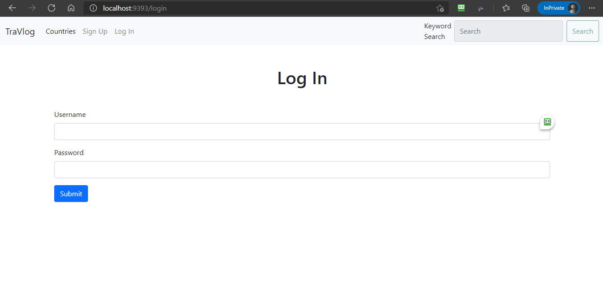

# TraVlog Sinatra App

by Jinook Jung

* * * * * * * * * *

## How To Set Up the App

1. Visit my [Github repository](https://github.com/jinook929/_flatiron_project2) and clone the code to your local directory:\

 `git clone https://github.com/jinook929/_flatiron_project2.git`

2. Enter into the *_flatiron_project2* folder: `cd _flatiron_project2`.
3. Execute `bundle install` and run `shotgun` in terminal.
4. Then, open your browser at `http://localhost:9393/`.

## How To Use the App

1. You can either sign up for your own account or use the existing accounts to log in.
2. Before logging in, user still can see vlog list by countries and each individual vlog from there, but no more than that.
3. If you log in as `super` (password: 123), you can create, read, update, and delete vlogs, comments, and even users, like making someone else admin, except for deleting yourself.
4. If you log in as `admin` (password: 123), you can create, read, and update vlogs, and create, read, update, and delete comments, and read the users.
5. If you log in as normal user (`user`, password: 123), you can create, update, and delete your own vlogs and comments, and read all vlogs and comments.
6. Each user has access to his/her own profile (user info, vlog info, country info, and comment info) through `Welcome, USER` link on the navbar.
7. Keyword search is available for any logged-in user via the search box on the navbar.

## Screen Captures

### Landing Page

### Signup Page

### Login Page

### Country List Page

### Vlog List Page

## Data Structure

### Country Info & Weather Info (by sources)

* [World Countries API](http://www.geognos.com/geo/en/world-countries-API.html)
* [Google Geocoding API](https://developers.google.com/maps/documentation/geocoding/get-api-key)
* Scraping of Country Details Web Pages (e.g. [Korea](http://www.geognos.com/geo/en/cc/kr.html))
* Scraping of Weather Info Website ([Dark Sky](https://darksky.net/forecast/37,127.3/) [with latitude & longitude info of the country])
* [List of capital cities with latitude and longitude](https://www.jasom.net/list-of-capital-cities-with-latitude-and-longitude/)
* [Ruby Geocoder Gem](http://www.rubygeocoder.com/)

### Object Keys (sorted by classes & sources)

* **Country** (*basics*) [Country API] :name, :capital, :url, :lat, :long
* **Country** (*details*) [Country SCRAPING] :location, :language, :population, :currency, :background(*, and sometimes* :capital)
* **Weather** (*area*) [Google Geocoding API] :area
* **Weather** (*weather related*) [Weather SCRAPING] :temperature, :feels, :wind, :summary

## References

### Module Sections

* getting-remote-data-working-with-apis 
* oo-student-scraper 
* scraping-flatiron-code-along
* scraping-kickstarter
* weather-app
* worlds-best-restaurants-cli-gem 

### Web Resources

* Colorize [Docs](https://github.com/fazibear/colorize)
* HTTParty [Docs](https://github.com/jnunemaker/httparty/tree/master/docs)
* Nokogiri [Docs](label-Parsing+and+Querying)
* dotenv [Docs](https://github.com/bkeepers/dotenv)

## Contributing

Bug reports and pull requests are welcome on GitHub at https://github.com/jinook929/_flatiron_project1. This project is intended to be a safe, welcoming space for collaboration, and contributors are expected to adhere to the [Contributor Covenant](contributor-covenant.org) code of conduct.

## Contributors

* Jinook Jung <jinook929@gmail.com>

## License & Copyright

© Jinook Jung

The app is available as open source under the terms of the [MIT License](http://opensource.org/licenses/MIT).
